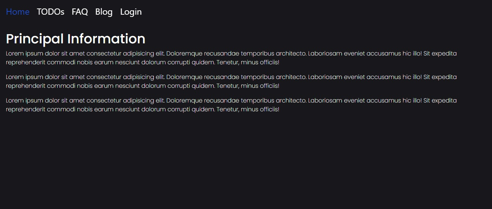
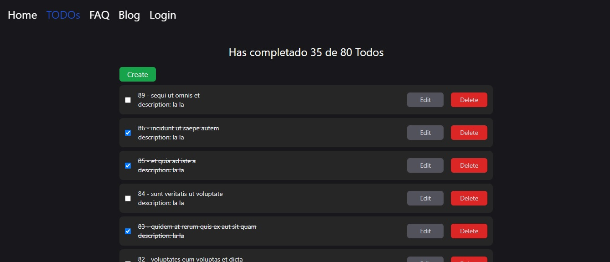

# TODO created for educational purposes

## Getting Started

```Javascript
npm install
npm run server
npm run dev
```

This app was built to show the very basic use of React bootstrapped with Vite, Redux Toolkit Query (RTK), React Router and TailwindCSS.

A menu is shown with which you can access the different links of the application using these technologies, in the case of TODO it contains a CRUD to interact with it.



